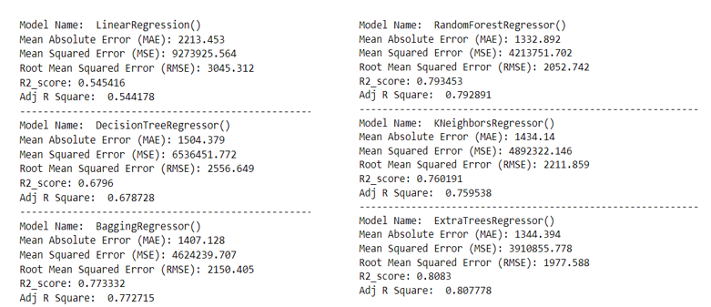
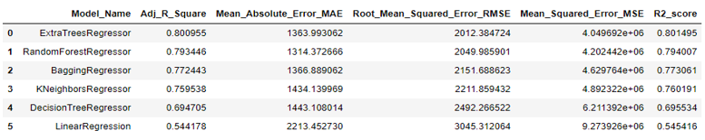
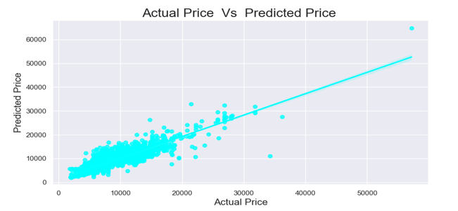

# CS5710-ML-Final-Project

# Performance Analysis of Machine Learning Techniques for Flight Ticket Price Forecasting

Done By:
* Jaswanth Reddy Gillella (Student ID: 700744964)
* Berlin Bino Bright Christel Pappa (Student ID:700741472)
* Ketan Sai Vemuri (Student ID:700746604)

#Results:
# Analysis of Model Performance

# Choosing the Model

# Actual Price and Predicted Price

# Regular Plot For Actual Price Vs Predicted Price

# Video Explanation of the project:

* click here [https://drive.google.com/file/d/1mTRkWp_WsjGu8XRDzP2y3OgcX6iiL5iw/view?usp=sharing]

